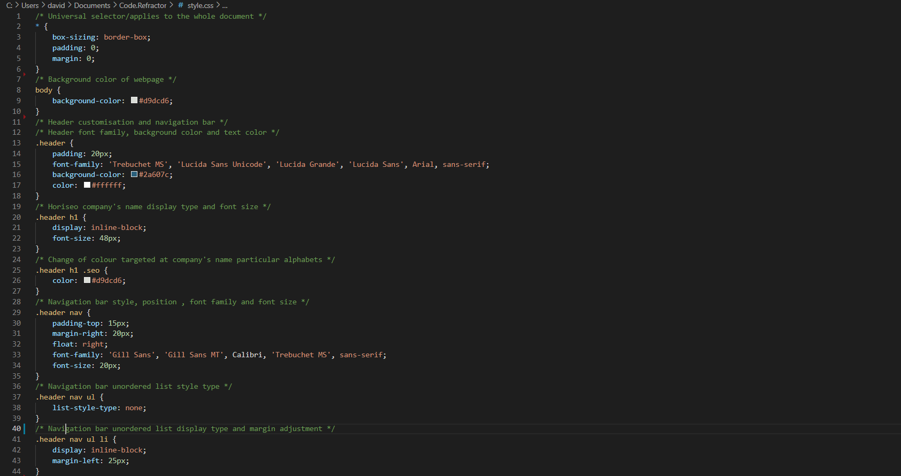

# **CODE REFRACTOR**


## **Description**

Refactoring existing code (improving it without changing what it does) to meet a certain set of standards or to implement a new technology. A marketing agency has hired me to refactor an existing site to make it more accessible.

## **Table Of Contents**

1. Links to deployed application and Github repository (public).
2. User Story
3. Acceptance Criteria
4. Website Screenshot
5. HTML Screenshot
6. CSS Screenshot
7. Credits


## **Links**

 #### View Deployed application @ https://davidlemerle.github.io/Horiseon-Website-Refactoring/
 #### Project repository @ https://github.com/davidlemerle/Horiseon-Website-Refactoring


## **User Story**

```
AS A marketing agency
I WANT a codebase that follows accessibility standards
SO THAT our own site is optimized for search engines
```

## **Acceptance Criteria**

```
GIVEN a webpage meets accessibility standards
WHEN I view the source code
THEN I find semantic HTML elements
WHEN I view the structure of the HTML elements
THEN I find that the elements follow a logical structure independent of styling and positioning
WHEN I view the image elements
THEN I find accessible alt attributes
WHEN I view the heading attributes
THEN they fall in sequential order
WHEN I view the title element
THEN I find a concise, descriptive title
```
## **Website Screenshot**


## **HTML Screenshot**


## **CSS Screenshot**


## **Credits**

#### Horiseon Social Solution Services, Inc.
#### Ahmed Meedaxa (Bootcamp Assigned Tutor)

